# kubeinfra — GitOps-Driven EKS Platform

> Production-shaped Kubernetes platform on AWS: IaC → CI/CD → GitOps → Security → Observability → DR

## Architecture

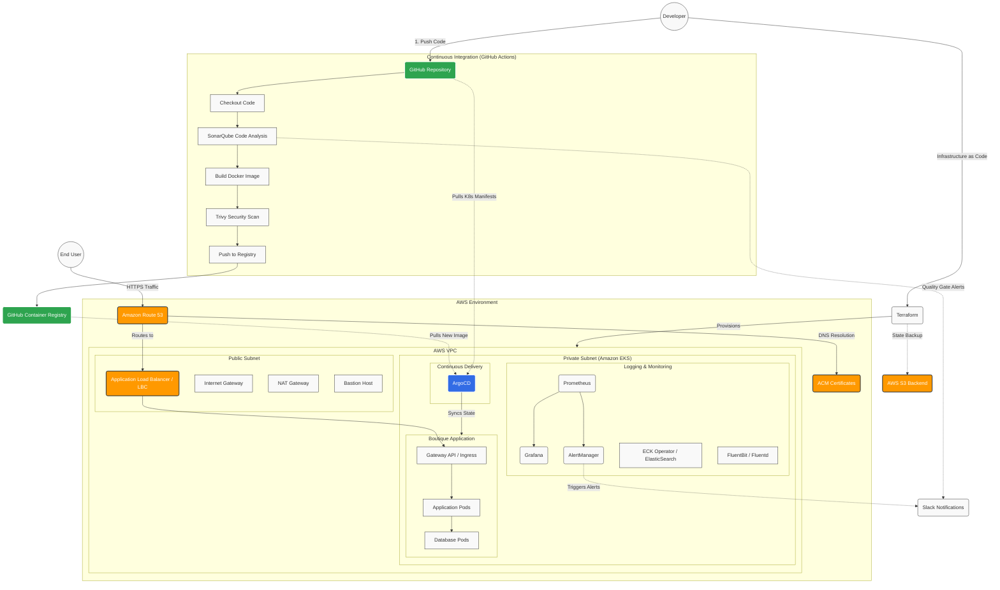

## Repository Layout

```
Devops_pow/
├── terraform/
│   ├── modules/
│   │   ├── vpc/          # VPC, subnets (2 AZ), NAT, SGs, bastion SG
│   │   ├── eks/          # EKS cluster, OIDC/IRSA, node group, add-ons
│   │   ├── bastion/      # Bastion host EC2 + key pair
│   │   ├── iam/          # IRSA roles: ALB controller, External DNS, ArgoCD
│   │   ├── s3-backend/   # Remote state bucket + DynamoDB lock table
│   │   └── route53/      # Hosted zone + ACM cert + DNS validation
│   └── envs/dev/         # Root module wiring all modules together
│
├── ci/
│   └── .github/workflows/
│       ├── ci.yaml           # Build → SonarQube → Trivy → Push to GHCR
│       └── pr-checks.yaml    # Lint + format checks on PRs
│
├── k8s-manifests/
│   ├── boutique-app/         # Online Boutique app (Kustomize base + dev overlay)
│   ├── argocd/               # ArgoCD Application CRs + Image Updater config
│   ├── gateway-api/          # GatewayClass, Gateway, HTTPRoute manifests
│   ├── logging/              # ECK operator, Elasticsearch, Kibana, Filebeat
│   ├── monitoring/           # Prometheus, Grafana, Alertmanager Helm values
│   ├── networking/           # AWS LB Controller + External DNS Helm values
│   ├── autoscaling/          # HPA manifests + load generator
│   └── dr/                   # Velero + MinIO for backup/restore
│
├── scripts/
│   ├── bootstrap.sh          # One-shot: init remote state → apply all Terraform
│   ├── kubeconfig.sh         # Configure kubectl via bastion tunnel
│   └── destroy.sh            # Tear-down in correct dependency order
│
└── docs/
    └── architecture-diagram.svg
```

## Quick Start

### Prerequisites
- AWS CLI configured (`aws configure`)
- Terraform ≥ 1.7
- kubectl, helm, argocd CLI

### Step 1 — Bootstrap Remote State
```bash
cd terraform/envs/dev
terraform init
terraform apply -target=module.s3_backend
```

### Step 2 — Provision Infrastructure
```bash
terraform apply   # VPC → Bastion → EKS → IAM → Route53 (~20 min)
```

### Step 3 — Configure kubectl (via bastion tunnel)
```bash
bash scripts/kubeconfig.sh
kubectl get nodes
```

### Step 4 — Install in-cluster components (via Helm through bastion)
```bash
# AWS Load Balancer Controller
helm upgrade --install aws-load-balancer-controller eks/aws-load-balancer-controller \
  -n kube-system -f k8s-manifests/networking/aws-lb-controller/values.yaml

# External DNS
helm upgrade --install external-dns bitnami/external-dns \
  -n kube-system -f k8s-manifests/networking/external-dns/values.yaml

# ArgoCD
helm upgrade --install argocd argo/argo-cd \
  -n argocd --create-namespace -f k8s-manifests/argocd/values.yaml

# Monitoring stack
helm upgrade --install kube-prometheus-stack prometheus-community/kube-prometheus-stack \
  -n monitoring --create-namespace -f k8s-manifests/monitoring/prometheus/values.yaml

# ECK Operator + stack
kubectl apply -f k8s-manifests/logging/
```

### Step 5 — Deploy App via ArgoCD
```bash
kubectl apply -f k8s-manifests/argocd/apps/
# ArgoCD auto-syncs boutique-app from this repo
```

## CI/CD Flow

1. `git push` → GitHub Actions triggers
2. **SonarQube** quality gate (fail = pipeline stops)
3. **Trivy** image scan (HIGH/CRITICAL = pipeline stops)
4. Push to **GHCR**
5. **GitHub Actions** automatically updates `kustomization.yaml` in Git with the new image tag (short commit SHA).
6. **ArgoCD** detects the git commit, reconciles the cluster, and triggers a rolling update of the new pods.

## Observability URLs (post-apply)

| Service | URL |
|---|---|
| App | `https://app.kubeinfra.site` |
| ArgoCD | `https://argocd.kubeinfra.site` |
| Grafana | `https://grafana.kubeinfra.site` |
| Kibana | `https://kibana.kubeinfra.site` |
| Prometheus | `https://prometheus.kubeinfra.site` |

## Proof of Work / Visual Flow

The following screenshots demonstrate the end-to-end working state of the platform: from infrastructure provisioning to CI/CD, GitOps deployment, and observability.

### 1. Infrastructure & Networking
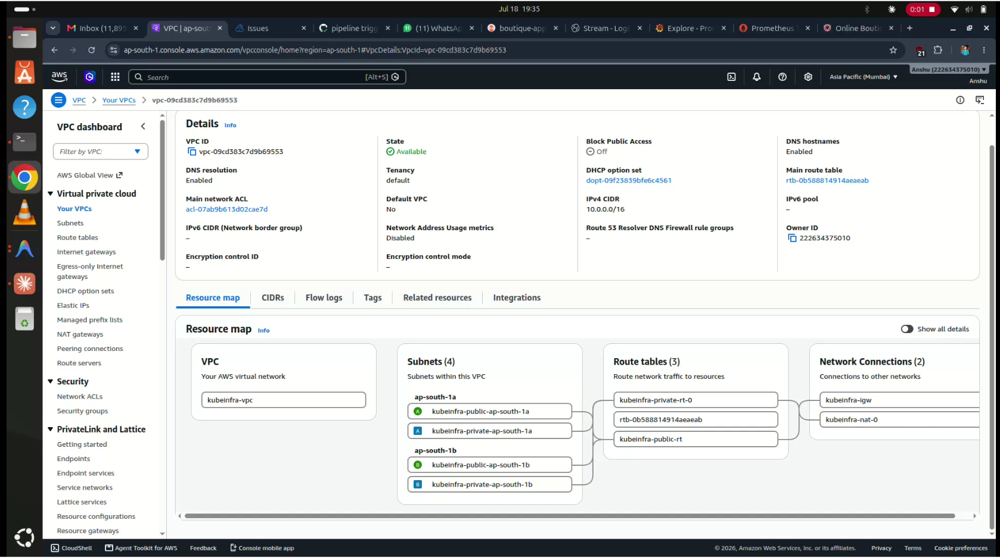
*AWS VPC Dashboard showing the underlying network architecture (Subnets, NAT Gateways, Route Tables).*

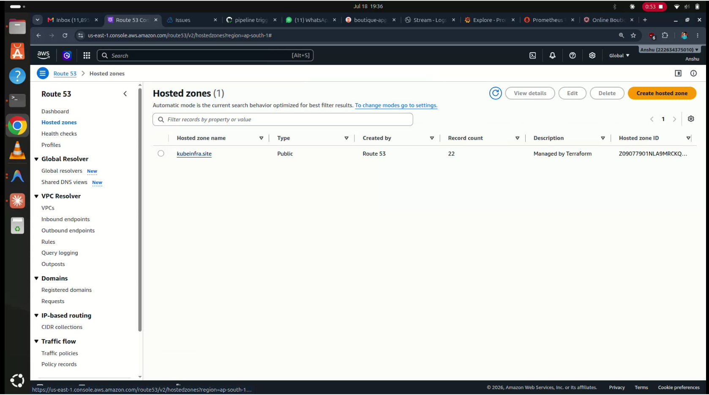
*AWS Route53 Hosted Zone automatically configured for custom domain routing and ACM TLS validation.*

### 2. Kubernetes Cluster (Amazon EKS)
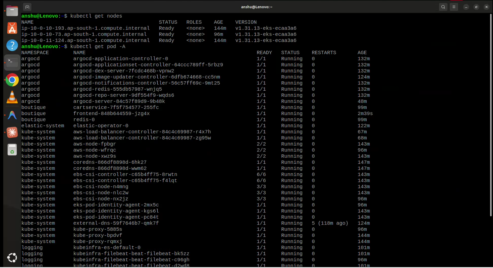
*Kubernetes nodes and pods successfully provisioned and running the microservices stack.*

### 3. CI/CD & GitOps
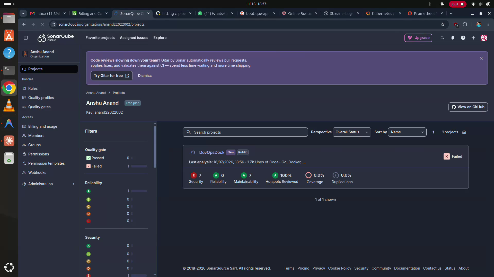
*SonarQube enforcing strict code quality and security gates before the Docker build proceeds.*

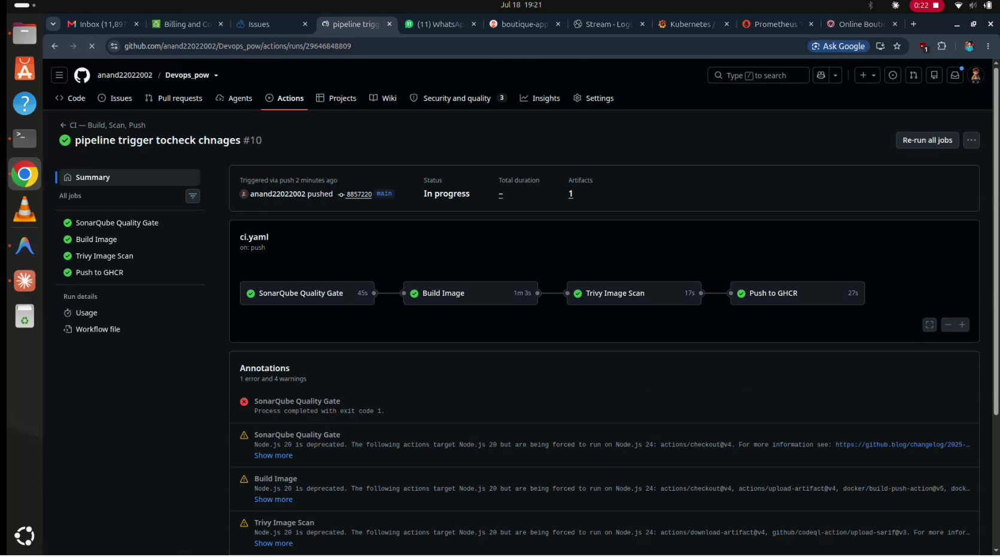
*GitHub Actions CI pipeline successfully building, scanning via Trivy, and pushing the container image.*

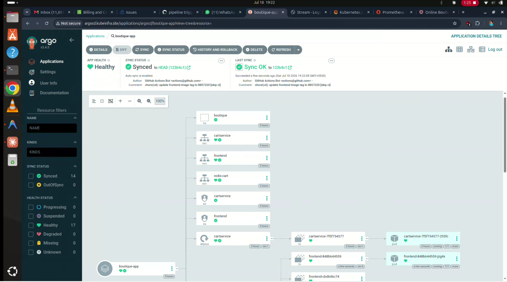
*ArgoCD automatically detecting Git state changes and reconciling the EKS cluster (GitOps).*

### 4. Application & Routing
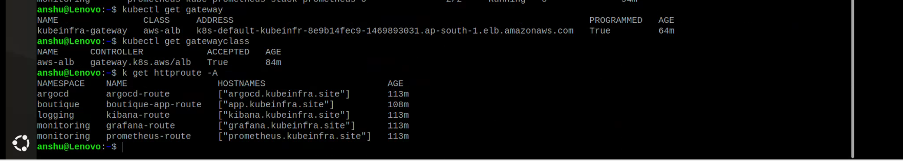
*Kubernetes Gateway API HTTPRoutes effectively managing ingress traffic via AWS ALB.*

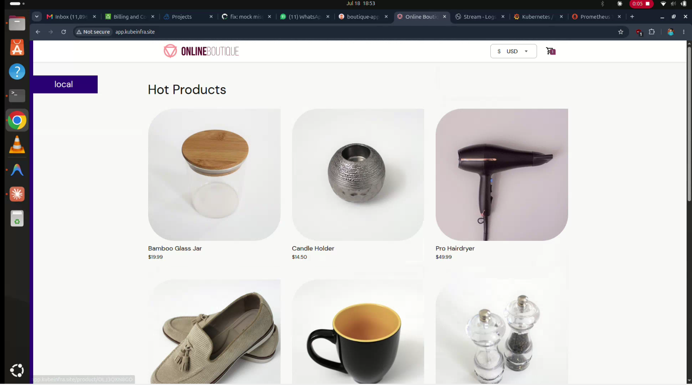
*The Online Boutique microservices application successfully deployed and accessible over HTTPS.*

### 5. Observability (Logging & Monitoring)
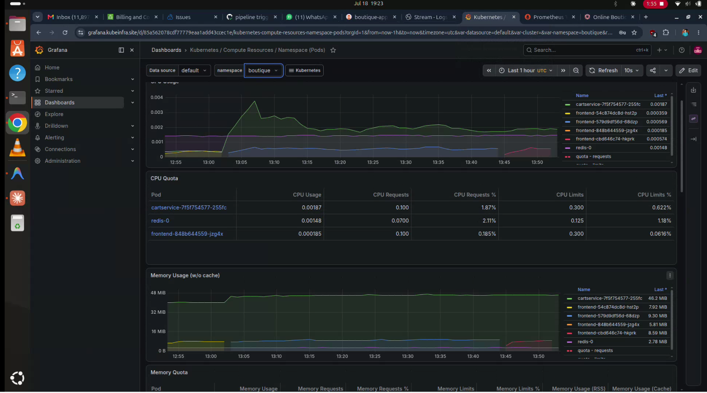
*Grafana dashboard visualizing real-time cluster metrics pulled from Prometheus.*

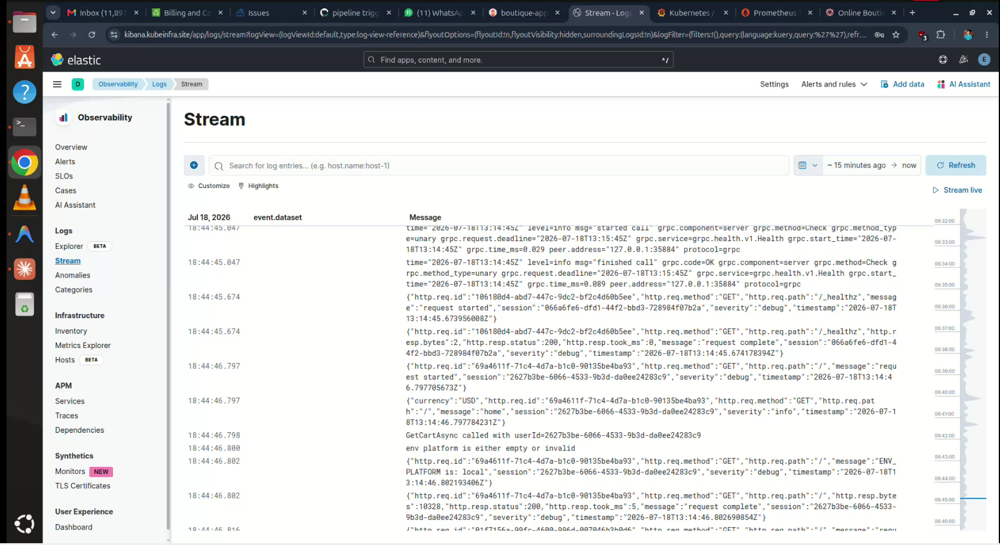
*Kibana interface centralizing and analyzing logs collected by Filebeat via Elasticsearch.*

## Cost Estimate (dev, always-on)

| Resource | ~Cost/mo |
|---|---|
| EKS Control Plane | $72 |
| 2× t3.medium nodes | $60 |
| NAT Gateway (single) | $32 |
| Bastion t3.micro | $8 |
| Route53 + ACM | $1 |
| **Total** | **~$173/mo** |

> 💡 Destroy NAT + EKS when not working. State is in S3 so you can recreate in ~20 min.
